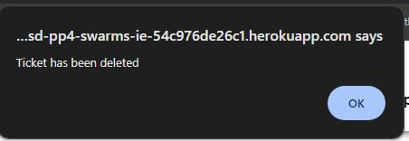

# Swarms

## Features

Web application has the following pages:

- home page
- login page
- registration page
- logout page
- profile page
- edit profile page
- change password page
- report a swarm page
- about page
- Open Tickets page
- Resolved Tickets page
- Unresolved Tickets page

## Homepage

- Navigation bar with links for going between pages
- beekeeper login and sign-up
- multiple report swarms call to actions
- statistics about the company
- about the company links
- beekeeper information
- footer
  
  

## report page

- Navigation bar with links for going between pages
- beekeeper login and sign-up
- progress bar
- report a swarm form

  - form validation
  - confirmation section
    
    
    

- footer
  
  

## About page

- Navigation bar with links for going between pages
- beekeeper login and sign-up
- about the company information

- footer
  
  

## sign-in page

- Navigation bar with links for going between pages
- sign-in form

- footer
  

## sign-up page

- Navigation bar with links for going between pages
- sign-up form

- footer
  

## open tickets page

- Navigation bar with links for going between pages for staff
- table with list of open tickets with detailed information and links to tickets
- filter to filter tickets by assignee or reported by first name
- if table is blank "There are no tickets to show" is shown
- modal for instructions on how to use the search bar
- footer
  
  

## resolved tickets page

- Navigation bar with links for going between pages for staff
- table with list of open tickets with detailed information and links to tickets
- filter to filter tickets by assignee or reported by first name
- if table is blank "There are no tickets to show" is shown
- modal for instructions on how to use the search bar
- footer
  
  

## unresolved tickets page

- Navigation bar with links for going between pages for staff
- table with list of open tickets with detailed information and links to tickets
- filter to filter tickets by assignee or reported by first name
- if table is blank "There are no tickets to show" is shown
- modal for instructions on how to use the search bar
- footer
  
  

## ticket page

- Navigation bar with links for going between pages for staff
- form is disabled by default and ticket boxes are needed to enable
- feedback is given to the staff member once the ticket has been updated
  
  

- admins have access to delete ppi (Personal and private information)

  - on request, they need to confirm this is the action to take
  - feedback is given once updated
    
    

- admins have access to delete a ticket

  - on request, they need to confirm this is the action to take
  - feedback is given once updated
  - page is redirected back to all open tickets
    
    

- footer
  

## logout page

- javascript automatically logs user out after, all staff see is a loading screen while this loads.
  
