link to site:
[Link to live site](https://ci-sd-pp4-swarms-ie-54c976de26c1.herokuapp.com/).

# About:

This site is a ticket management system for a company called Swarms.ie
Swarms is a honeybee removal charity business, that connects people with beekeepers to remove colonies and swarms from their property.
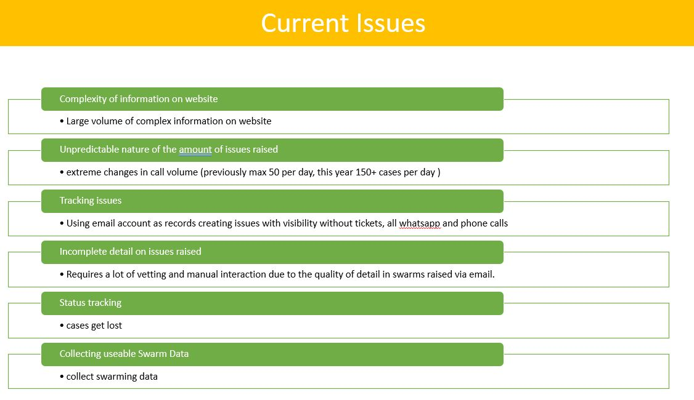
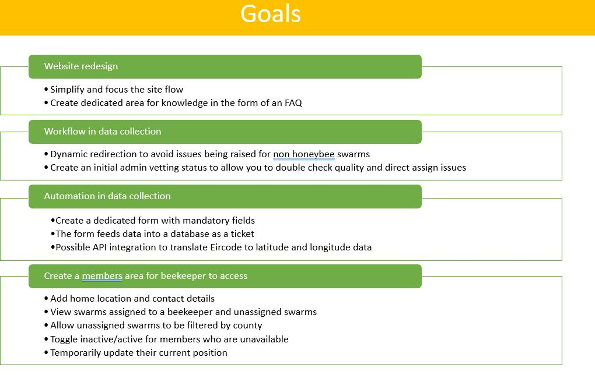

## The "problem" / issue to fix

The purpose of this site is to make the process of connecting people to beekeepers more efficient for the Swarms.ie owner as currently this is a manual effort task through spreadsheets and phone calls / text messages.

This site allows visitors to log a Service Request (SR) with Swarms for the removal of the swarm 365 days and without the need for phone calls / emails

# UX:

The website was created to be eye-catching and user-friendly. The emphasis is on the user experience; the user can navigate the website easily to log their Service Request.

## Accessibility:

The website is designed to be accessible by all, with features like:

- Skip to Content link

  -When tabbing through the site the user will be preseneted with a skip to content link which bypasses the header section and is linked to <main>

- Colours chosen
  - #ea9d34 (yellow) colour chosen had contrast issues on a white background, this was updated to #8b4313 (brown) to provide a higher contrast for users.
- Form
  - the form uses the "hidden" attribute to show and hide content for users while not impacting the accessibility tree or making the form confusing
  - ARIA labelled by: this is also heavily featured in the form to provide context of the questions for those who may need this.

-Role = "Presentation" in the report-a-swarm page for the progress bar.
this is to inform the users that the context of this is purely decoration purposes and is not required for them to complete the form

- Prefers reduced motion:
  on the report-a-swarm page, there is an animated fieldset border (Black and yellow) and loading divs prefers reduced motion is present for those with motion sickness that it does not cause disorientation side effects this has been tested by me (as I suffer with this, and does not have any unwanted side effects) .

If the user has a preference set for reduced motion, the animations are slowed down, and overall animation is reduced. This is to reduce animations that can make users nauseous (vestibular dysfunction) to test this in Chrome

  <ul>
  <li>
    If the user has a preference set for reduced motion, the animations are
    slowed down, and overall animation is reduced. This is to reduce animations
    that can make users nauseous (vestibular dysfunction) to test this in Chrome
  </li>
  <ol>
    <li>Go to Inspect</li>
    <li>Select the 3 dots beside the X for close</li>
    <li>Select “Run command”</li>
    <li>Search for “Reduced”</li>
    <li>Click the “Do not emulate CSS prefers-reduced-motion”</li>
    <li>
      Refresh the page, and you will notice that the animation does not run.
    </li>
    <li>To undo this open the site in a new tab.</li>
  </ol>

### testing

[Link to testing documentation](https://github.com/Shane-Donlon/ci-pp4-django/blob/main/TESTING.md).

### features

[Link to features documentation](https://github.com/Shane-Donlon/ci-pp4-django/blob/main/FEATURES.md).

### bugs

#### resolved bugs

<table>
<thead>
  <tr>
    <th>Page</th>
    <th>Language</th>
    <th>Description</th>
    <th>Resolution</th>
    <th>Cause</th>

  </tr>
</thead>
<tbody>
  <tr>
    <td>Report-Swarm</td>
    <td>JavaScript</td>
    <td>Using regex on phone to confirm if number is correct, if at any point an error appeared I would set the custom error to be more descriptive than pattern does not match, once I corrected the error on change and next would still set the error and could not move onto the next section of the form
    event.target.setCustomValidity("Please enter phone number in 353121234567 format");</td>
    <td> event.target.setCustomValidity(""); </td>
    <td> As I'm setting the error to true by using a non-empty string I need to set this back to false using an empty string after the error appears </td>
  </tr>
</tbody>
</table>

## Technologies used

- ### Languages:

  - [Python 3.11](https://www.python.org/downloads/release/python-3110/): the primary language used to develop the server-side of the website.
  - [JS](https://www.javascript.com/): the primary language used to develop interactive components of the website.
  - [HTML](https://developer.mozilla.org/en-US/docs/Web/HTML): the markup language used to create the website.
  - [CSS](https://developer.mozilla.org/en-US/docs/Web/css): the styling language used to style the website.

- ### Frameworks and libraries:

  - [Django](https://www.djangoproject.com/): python framework used to create all the logic.

- ### Databases:

  - [SQLite](https://www.sqlite.org/): was used as a development database.
  - [PostgreSQL](https://www.postgresql.org/): the database used to store all the data.

- ### Other tools:
  - [Git](https://git-scm.com/): the version control system used to manage the code.
  - [Pip3](https://pypi.org/project/pip/): the package manager used to install the dependencies.
  - [Gunicorn](https://gunicorn.org/): the webserver used to run the website.
  - [Spycopg2](https://www.python.org/dev/peps/pep-0249/): the database driver used to connect to the database.
  - [Django-allauth](https://django-allauth.readthedocs.io/en/latest/): the authentication library used to create the user accounts.
  - [ElephantSQL](https://www.elephantsql.com/): the cloud database used to store all the data.
  - [GitHub](https://github.com/): used to host the website's source code.
  * [VSCode](https://code.visualstudio.com/): the IDE used to develop the website.
  * [Chrome DevTools](https://developer.chrome.com/docs/devtools/open/): was used to debug the website.
  * [Font Awesome](https://fontawesome.com/): was used to create the icons used in the website.
  - [W3C Validator](https://validator.w3.org/): was used to validate HTML5 code for the website.
  - [W3C CSS validator](https://jigsaw.w3.org/css-validator/): was used to validate CSS code for the website.
  - [JShint](https://jshint.com/): was used to validate JS code for the website.
  - [PEP8](https://pep8.org/): was used to validate Python code for the website.
  - [Cloudinary](https://cloudinary.com/): used to store images uploaded to site.
  - [django-filter](https://django-filter.readthedocs.io/en/stable/): used to filter querysets.
  - [django-tables2](https://django-tables2.readthedocs.io/en/latest/): used to provide responsive tables.
  - [django-widget-tweaks](https://django-tables2.readthedocs.io/en/latest/): used to modify the HTML of the rendered forms.
  - [whitenoise](https://whitenoise.readthedocs.io/en/latest/): used to serve the static files
  - [miro](https://miro.com/app/): used to draw diagrams
  - [bootstrap css](https://getbootstrap.com/): used to table responsiveness

### Process flow for tickets

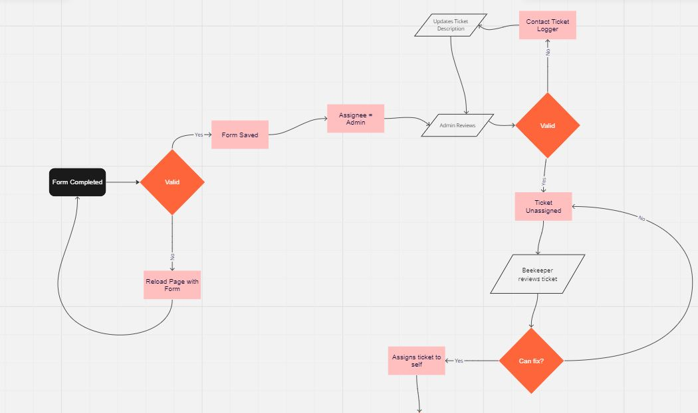
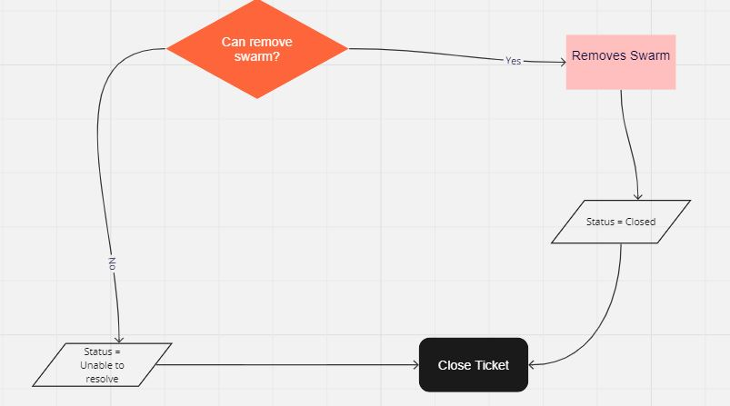

### Entity-Relationship Diagram

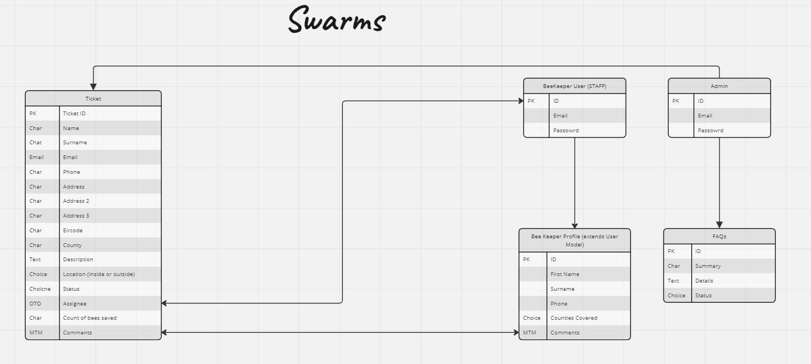

## lighthouse reports

### Index page

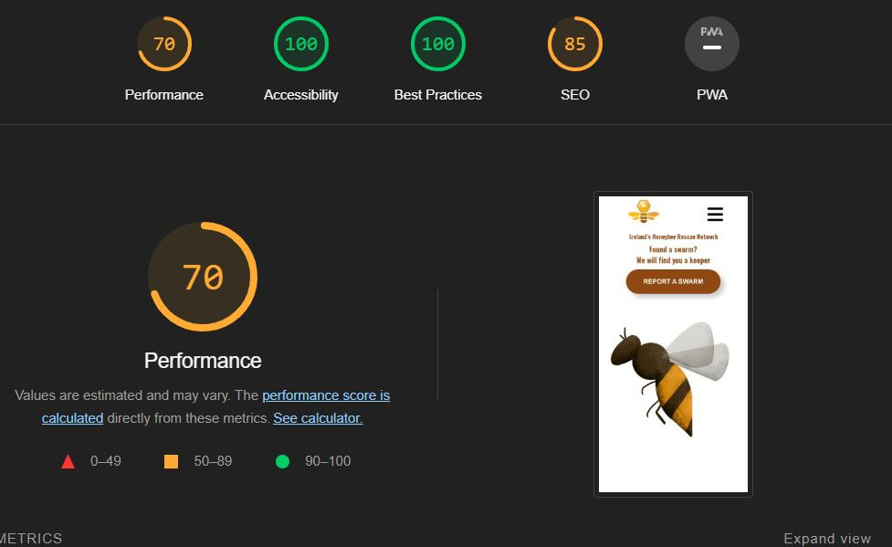

### About page

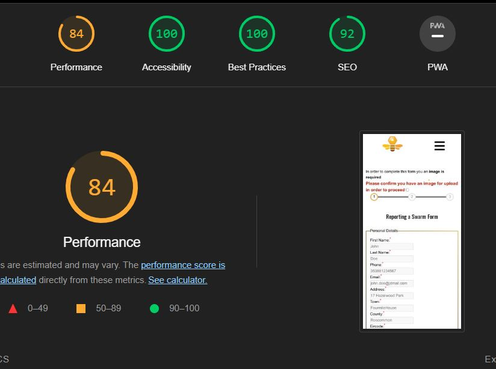

## design

### index

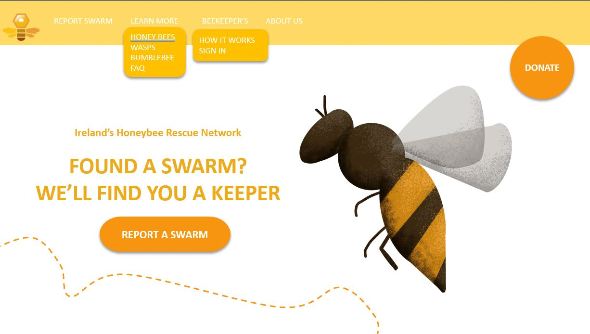
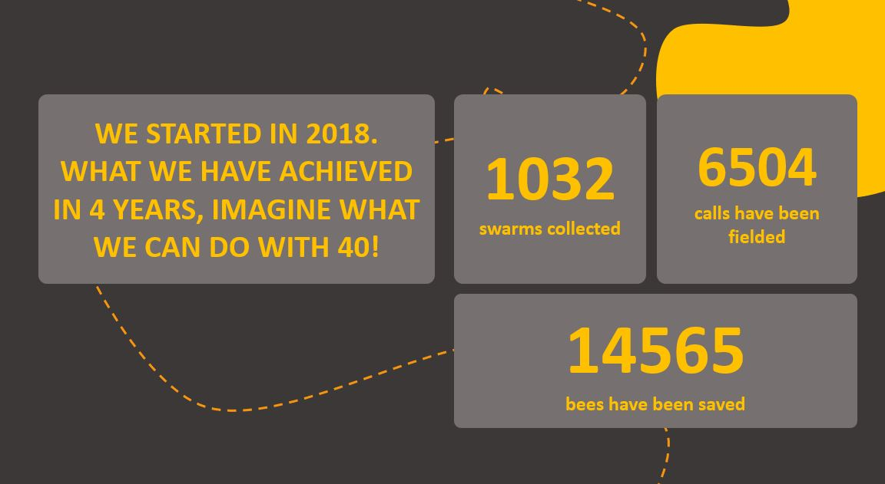

### about us

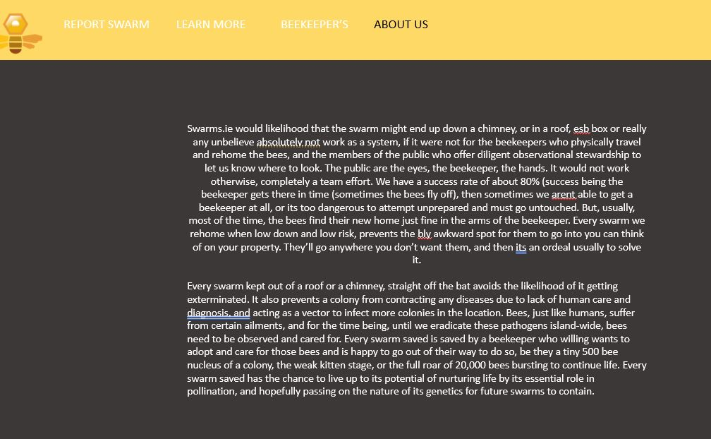

### sections

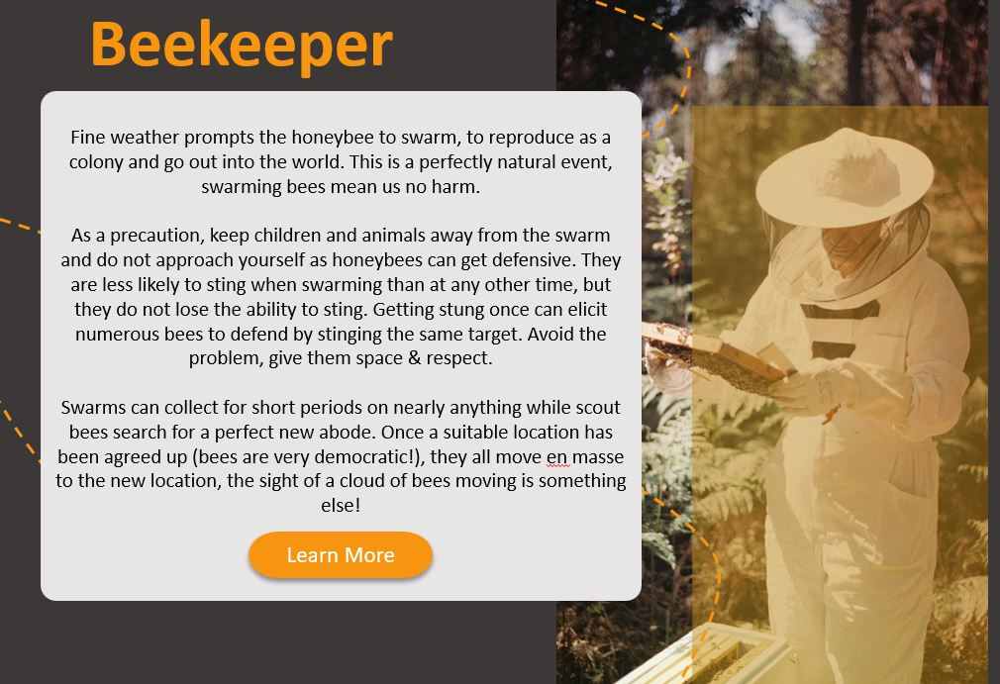

### wireframes desktop

[desktop design sections](documentation/wireframes/swarms-desktop.pdf)

[mobile design sections](documentation/wireframes/swarms-mobile.pdf)

### Known issues

Tables - especially with tables the design of this site was desktop orientated.
While the site is fully responsive and tables are responsive using bootstrap CSS the best experience for tables is via a desktop / tablet

### Credits

Chris Coiler [link to blog article](https://css-tricks.com/how-to-animate-the-details-element-using-waapi/)
Kevin Powell [link to codepen](https://codepen.io/kevinpowell/pen/xxyybmj)
